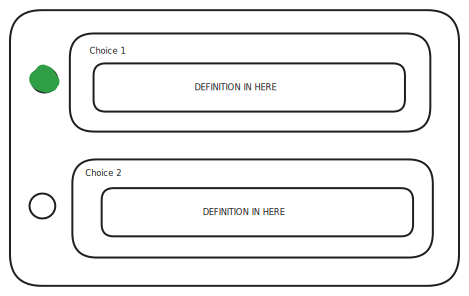

# [Bindings](https://github.com/search?q=repo%3Aanalogdevicesinc%2Flinux%20path%3A*adi%2C*.yaml%20anyOf%20OR%20oneOf%20OR%20allOf&type=code)

## Personal Notes

- most bindings in this query just use allOf for composition (e.g. SPI, dai-common, regulator)
- patterns mostly repeat even if a bit extended or a bit more quirky
- implementation for ad7124 already covers a lot of adi devices taking into account that the query resulted in 96 files from a total of 157

## Widgets 

### Choose One



## Examples

### [adi,ad4695.yaml](https://github.com/analogdevicesinc/linux/blob/0e6471fc0a0ee46a747b7d6875c8c112e20191fb/Documentation/devicetree/bindings/iio/adc/adi%2Cad4695.yaml#L181)

TODO: channel patternProperties says in description it supports `bipolar` from `adc.yaml` but won't mark `bipolar: true` in `properties` but then in `if/then` on the `then` branch it does a `bipolar: false`

```
allOf:
      # bipolar mode can't be used with REFGND
      - if:
          properties:
            common-mode-channel:
              const: 0xFF
        then:
          properties:
            bipolar: false
```

Common property constraint modifier

```
  - oneOf:
      - required:
          - ldo-in-supply
      - required:
          - vdd-supply
```

```
- oneOf:
      - required:
          - ref-supply
      - required:
          - refin-supply
```

These above could be a [Choose One](#choose-one) widget.

```
# the internal reference buffer always requires high-z mode
- if:
      required:
        - refin-supply
    then:
      properties:
        adi,no-ref-high-z: false
```

These types of binding modifications don't need a widget.

```
  # limit channels for 8-channel chips
  - if:
      properties:
        compatible:
          contains:
            enum:
              - adi,ad4697
              - adi,ad4698
    then:
      patternProperties:
        "^in(?:9|1[135])-supply$": false
        "^channel@[0-7]$":
          properties:
            reg:
              maximum: 7
            common-mode-channel:
              enum: [1, 3, 5, 7, 0xFE, 0xFF]
        "^channel@[8-9a-f]$": false
```

Interesting pattern that "overlays" a regex to reject extra options when a certain device is used and also to modify properties based on a regex.
Definitely very difficult to express in UI.

### [adi,ad5755](https://github.com/analogdevicesinc/linux/blob/0e6471fc0a0ee46a747b7d6875c8c112e20191fb/Documentation/devicetree/bindings/iio/dac/adi%2Cad5755.yaml#L116)

```
oneOf:
  - required:
      - spi-cpha
  - required:
      - spi-cpol
```

This is a [Choose One](#choose-one) widget.

### [adi,ad7923](https://github.com/analogdevicesinc/linux/blob/0e6471fc0a0ee46a747b7d6875c8c112e20191fb/Documentation/devicetree/bindings/iio/adc/adi%2Cad7923.yaml#L23)

```
properties:
  compatible:
    oneOf:
      - enum:
          - adi,ad7904
          - adi,ad7908
          - adi,ad7914
          - adi,ad7918
          - adi,ad7923
          - adi,ad7928
      - const: adi,ad7924
        deprecated: true
      - items:
          - const: adi,ad7924
          - const: adi,ad7923
      - items:
          - const: adi,ad7927
          - const: adi,ad7928
```

Example of using oneOf to be able to document a driver that supports multiple devices:
- compatible = "adi,ad7904" (works)
- compatible = "adi,ad7924" (works)
- compatible = "adi,ad7924", "adi,ad7923" (works)
- compatible = "adi,ad7904", "adi,ad7923" (does not work)

### [adi,ad7625](https://github.com/analogdevicesinc/linux/blob/0e6471fc0a0ee46a747b7d6875c8c112e20191fb/Documentation/devicetree/bindings/iio/adc/adi%2Cad7625.yaml#L120)

```
- if:
      properties:
        compatible:
          contains:
            enum:
              - adi,ad7960
              - adi,ad7961
    then:
      # ad796x parts must have one of the two supplies
      oneOf:
        - required: [ref-supply]
        - required: [refin-supply]
```

Here we have a conditionally appearing [Choose One](#choose-one)

```
- if:
      required:
        - ref-supply
    then:
      properties:
        refin-supply: false
  - if:
      required:
        - refin-supply
    then:
      properties:
        ref-supply: false
```

Here we have if/then used like a OneOf but taking into account that those properties aren't required, but if they appear they should be mutually exclusive.
There is no logical contradiction when having both conditions active at the same time.
Still it's a good question how that would translate in UI/UX, from a validation standpoint it's not a problem, but they would need a transformation from a mutually exclusive optional property pair to a [Choose One](#choose-one) widget and vice versa.

### [adi,pulsar](https://github.com/analogdevicesinc/linux/blob/0e6471fc0a0ee46a747b7d6875c8c112e20191fb/Documentation/devicetree/bindings/iio/adc/adi%2Cpulsar.yaml#L142)

```
- if:
      properties:
        compatible:
          contains:
            enum:
              - adi,pulsar,ad7949
              - adi,pulsar,ad7699
              - adi,pulsar,ad7689
              - adi,pulsar,ad7682

    then:
      patternProperties:
        "^channel@([0-8])$":

          oneOf:
            # Only one property can be used at a time per channel
            - required:
                - adi,single-channel

            - required:
                - diff-channels

            - required:
                - adi,temp-sensor

    else:
      patternProperties:
        "^channel@([0-8])$":
          required:
            - adi,single-channel
```

Conditional pattern property overlay (this time it fully overlays => maybe this could be a pattern) to introduce a [Choose One](#choose-one) or to just make a property required.

### [adi,ltc2983](https://github.com/analogdevicesinc/linux/blob/0e6471fc0a0ee46a747b7d6875c8c112e20191fb/Documentation/devicetree/bindings/iio/temperature/adi%2Cltc2983.yaml#L1)

TODO : needs more information

The pattern properties here are used differently, I suspect there are 20 "connections" to this ltc that can be populated with either "adc" nodes, "temp" nodes, "rsense" nodes, etc.

Every node definition from there is based on:

```
 sensor-node:
    type: object
    description: Sensor node common constraints

    properties:
      reg:
        description:
          Channel number. Connects the sensor to the channel with this number
          of the device.
        minimum: 1
        maximum: 20

      adi,sensor-type:
        description: Type of sensor connected to the device.
        $ref: /schemas/types.yaml#/definitions/uint32

    required:
      - reg
      - adi,sensor-type
```

Which implies a new way is needed to be defined to handle this cases!

### [adi,ad7380](https://github.com/analogdevicesinc/linux/blob/0e6471fc0a0ee46a747b7d6875c8c112e20191fb/Documentation/devicetree/bindings/iio/adc/adi%2Cad7380.yaml#L163)

```
- if:
      properties:
        compatible:
          enum:
            - adi,ad7383
            - adi,ad7384
            - adi,ad7383-4
            - adi,ad7384-4
    then:
      required:
        - aina-supply
        - ainb-supply
    else:
      properties:
        aina-supply: false
        ainb-supply: false
```

Usage of if/then/else to make property required or strictly disabled

```
- if:
      properties:
        compatible:
          enum:
            - adi,adaq4370-4
            - adi,adaq4380-4
            - adi,adaq4381-4
    then:
      required:
        - vs-p-supply
        - vs-n-supply
        - ldo-supply
    else:
      properties:
        vs-p-supply: false
        vs-n-supply: false
        ldo-supply: false
      patternProperties:
        "^channel@[0-3]$": false
```

Usage of if/then/else to also overlay a regex to disable/enable channels

### [adi,ad3552r](https://github.com/analogdevicesinc/linux/blob/0e6471fc0a0ee46a747b7d6875c8c112e20191fb/Documentation/devicetree/bindings/iio/dac/adi%2Cad3552r.yaml#L127)

```
- if:
      properties:
        compatible:
          contains:
            enum:
              - adi,ad3541r
              - adi,ad3551r
    then:
      properties:
        channel@1: false
        channel@0:
          properties:
            reg:
              const: 0
```

Explicit channel disabled in this case where there normally are only 2 channels anyways

### [adi,ad7173](https://github.com/analogdevicesinc/linux/blob/0e6471fc0a0ee46a747b7d6875c8c112e20191fb/Documentation/devicetree/bindings/iio/adc/adi%2Cad7173.yaml#L240)

```
allOf:
      - oneOf:
          - required: [single-channel]
            properties:
              diff-channels: false
          - required: [diff-channels]
            properties:
              single-channel: false
              adi,current-channel: false
              common-mode-channel: false
```

We have an extended capability [Choose One](#choose-one)


```
 if:
      anyOf:
        - required: [clock-names]
        - required: [clocks]
    then:
      properties:
        '#clock-cells': false
```

This could be a inverted conditional? Also like to keep seeing this as a conditionally disablement for properties in general

### [adi,adm1275](https://github.com/analogdevicesinc/linux/blob/0e6471fc0a0ee46a747b7d6875c8c112e20191fb/Documentation/devicetree/bindings/hwmon/adi%2Cadm1275.yaml#L50)

```
- if:
      properties:
        compatible:
          contains:
            enum:
              - adi,adm1075
              - adi,adm1276
    then:
      properties:
        adi,volt-curr-sample-average:
          default: 128
        adi,power-sample-average: false
```

This looks like a strong suggestion to use a default but no real constraint 

### [adi,adp5588](https://github.com/analogdevicesinc/linux/blob/0e6471fc0a0ee46a747b7d6875c8c112e20191fb/Documentation/devicetree/bindings/input/adi%2Cadp5588.yaml#L16)

```
dependencies:
  keypad,num-rows:
    - linux,keymap
    - keypad,num-columns
  keypad,num-columns:
    - linux,keymap
    - keypad,num-rows
  linux,keymap:
    - keypad,num-rows
    - keypad,num-columns
    - interrupts
  interrupt-controller:
    - interrupts
```

Not that interesting, should happen automatically but good to have an example noted.

### [adi,hmc425a](https://github.com/analogdevicesinc/linux/blob/0e6471fc0a0ee46a747b7d6875c8c112e20191fb/Documentation/devicetree/bindings/iio/amplifiers/adi%2Chmc425a.yaml#L48)

```
- if:
      properties:
        compatible:
          contains:
            anyOf:
              - const: adi,adrf5740
              - const: adi,hmc540s
    then:
      properties:
        ctrl-gpios:
          minItems: 4
          maxItems: 4
```

Not entirely that interesting (in this exact case won't do anything as compatible is a simple enum), but it's a new pattern anyways, that is easy to implement.

### [adi,ad74114](https://github.com/analogdevicesinc/linux/blob/0e6471fc0a0ee46a747b7d6875c8c112e20191fb/Documentation/devicetree/bindings/iio/addac/adi%2Cad74115.yaml#L91)

```
adi,conv2-range-microvolt:
    description: Conversion range for ADC conversion 2.
    oneOf:
      - items:
          - enum: [-2500000, 0]
          - const: 2500000
      - items:
          - enum: [-12000000, 0]
          - const: 12000000
      - items:
          - const: -2500000
          - const: 0
      - items:
          - const: -104000
          - const: 104000
      - items:
          - const: 0
          - const: 625000
```

Interesting pattern, this could be a modified, more complex [Choose One](#choose-one)?

### [adi,axi-dac](https://github.com/analogdevicesinc/linux/blob/0e6471fc0a0ee46a747b7d6875c8c112e20191fb/Documentation/devicetree/bindings/iio/dac/adi%2Caxi-dac.yaml#L59)

```
- if:
      properties:
        compatible:
          contains:
            const: adi,axi-ad3552r
    then:
      $ref: /schemas/spi/spi-controller.yaml#
      properties:
        clocks:
          minItems: 2
        clock-names:
          minItems: 2
      required:
        - clock-names
    else:
      properties:
        clocks:
          maxItems: 1
        clock-names:
          maxItems: 1
```
// TODO
Interesting way to conditionally enable SPI "support".

### [adi,ltc6952](https://github.com/analogdevicesinc/linux/blob/0e6471fc0a0ee46a747b7d6875c8c112e20191fb/Documentation/devicetree/bindings/iio/frequency/adi%2Cltc6952.yaml#L60)

```
 adi,pulse-generator-mode:
    description: |
      Select the pulse generator mode. Valid values are:
      0: One Pulse
      1: Two Pulses
      2: Four Pulses
      3: Eight Pulses
      If this field is left empty, One Pulse is selected.
    allOf:
      - $ref: /schemas/types.yaml#/definitions/uint32
      - enum: [0, 1, 2, 3]
```

This looks wrong, normally the `$ref` is outside to make this inherited and the `enum` as well. In this way it's composition which should work the same but it's just weird that there are 2 ways to do the same thing.

### [adi,ad7192](https://github.com/analogdevicesinc/linux/blob/0e6471fc0a0ee46a747b7d6875c8c112e20191fb/Documentation/devicetree/bindings/iio/adc/adi%2Cad7192.yaml#L147)

```
oneOf:
      - required:
          - reg
          - diff-channels
      - required:
          - reg
          - single-channel
```

This is a [Choose One](#choose-one) but also it's a bad definition, `reg` should just be factored out in a normal required.

```
 - if:
      anyOf:
        - required:
            - clocks
        - required:
            - clock-names
    then:
      properties:
        "#clock-cells": false
      required:
        - clocks
        - clock-names
```

This is an insane way to define `dependencies` between clocks and clock-names and make it conditionally disable `#clock-cells`

### [adi,ad7191](https://github.com/analogdevicesinc/linux/blob/0e6471fc0a0ee46a747b7d6875c8c112e20191fb/Documentation/devicetree/bindings/iio/adc/adi%2Cad7191.yaml#L108)

```
allOf:
  - $ref: /schemas/spi/spi-peripheral-props.yaml#
  - oneOf:
      - required:
          - adi,odr-value
      - required:
          - odr-gpios
  - oneOf:
      - required:
          - adi,pga-value
      - required:
          - pga-gpios
```

Double [Choose One](#choose-one).


### [adi, adp5585](https://github.com/analogdevicesinc/linux/blob/286057f8508b2bc76111896dbc85f92ffcb026b6/Documentation/devicetree/bindings/mfd/adi%2Cadp5585.yaml#L45)

TODO : needs more information

### [adi,adf4030](https://github.com/analogdevicesinc/linux/blob/286057f8508b2bc76111896dbc85f92ffcb026b6/Documentation/devicetree/bindings/iio/frequency/adi%2Cadf4030.yaml#L88)

TODO : This is a obviously wrong pattern definition

### [adi,max11410](https://github.com/analogdevicesinc/linux/blob/286057f8508b2bc76111896dbc85f92ffcb026b6/Documentation/devicetree/bindings/iio/adc/adi%2Cmax11410.yaml#L67)

TODO : This is a obviously wrong pattern definition

### [adi,adis16475](https://github.com/analogdevicesinc/linux/blob/2449a083d718d25dcb5b83afa3aa765c3ed8529d/Documentation/devicetree/bindings/iio/imu/adi%2Cadis16475.yaml)

TODO : Talk about `spi-cpha` and `spi-cpol`
TODO : Talk about `#address-cells = <0>`
TODO : props grouping by origin